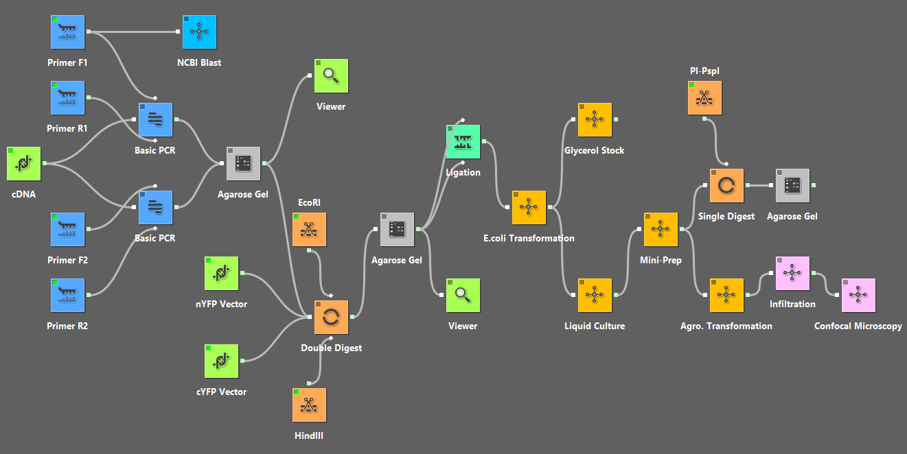
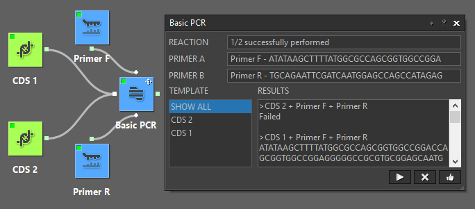
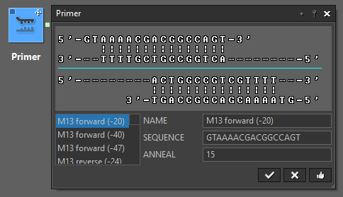
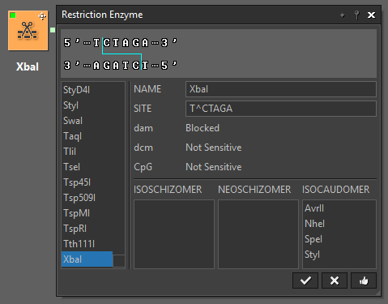
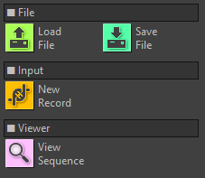
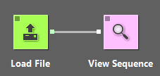
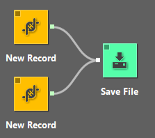
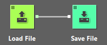
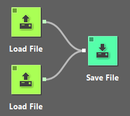
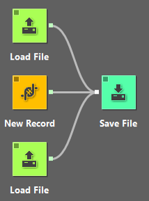

# ExpCatalyst
ExpCatalyst helps you create highly efficient and interactive workflow with ease. It is based on the idea that a workflow consists of a series of widgets, each representing a type of data or task that can be executed. ExpCatalyst lets you define the function of these widgets and reuse them to construct workflow with minimal repetition. When designing your lab tasks, whether dry or wet, you can always benefit from using ExpCatalyst.

ExpCatalyst allows its users to develop widgets with little programming efforts, as the framework autocompletes a large portion of the job. Users add widgets to the canvas, connect them to form a workflow, and interact with them through their associated dialogs to get real-time feedback. The two examples below demonstrate its usage. The first example shows how it assists the design of a specific experiment. The second example demonstrates its flexibility in handling different tasks.

## For wet lab tasks:
Suppose we want to use bimolecular fluorescence complementation to test the interaction between two proteins. The cDNA that has both genes is ready for use. We will tag them with either nYFP or cYFP by cloning them into corresponding vectors. Then, we need to express them in tobaccos and check them by confocal microscope.
A textual description of part of the experiment looks like this:
1. Perform PCR to amplify the two CDSs, and purify with agarose gel. Make sure the primers have the correct restriction sites.
2. Digest amplicons from the PCR and vectors for tagging with the same set of restriction enzymes.
3. Perform gel extraction.
4. Ligate the inserts with the vectors.
5. Transform to E.coli. Use LB with xxx resistance plate. Keep plate in 37C overnight.
6. ...

You're right to think that the description above is rather verbose. Yet, it still misses some important details in each step of the experiment. Let us instead look at how to represent the same experiment in a workflow:

* This workflow gives a clear layout of the steps in this experiment.
* Users can interact with the widgets. For example, we can input the primers, choose what enzyme to use, etc.
* It simulates the PCR and digestion experiments, and gives the hypothetical sequences produced. If a mistake is made in the design of the primers, some downstream step will send a warning by showing that the job cannot be done.
* Besides simulating experiments, the widgets show additional information related to a particular step. For example, the Double Digest widget can show the suitable buffer for reaction for the two enzymes passed to it.
* For steps such as "Mini-Prep" and "Glycerol Stock", simulation isn't necessary; but instructions for those steps will show up in their dialogs.
* A workflow can be easily redesigned by changing the input of its widgets or replacing existing widgets with new ones. For example, we can replace the "cDNA" widget with an "Entrez Efetch" widget to directly get the sequence from GenBank.

#### Here are some example dialogs:

## For dry lab tasks:
This example shows what users can do with just four widgets:

**LoadFile** - loads a FASTA or GenBank file, and sends sequence records to downstream widgets
**SaveFile** - saves the records received from upstream widgets to either FASTA or GenBank file
**NewRecord** - lets user input sequence directly
**ViewSequence** - shows the sequences sent to it

Show the sequence loaded

Saves input(s) to a sequence file

##### Some more interesting tasks:
Convert a file to another format

Merge files

Save files and direct input to a new file

